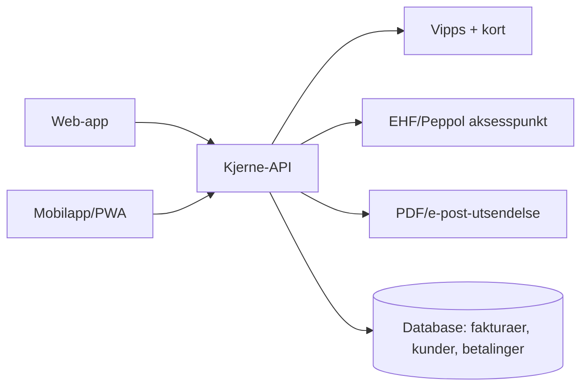

# Faktura-app: strategisk og teknisk grunnlag

Notater fra utforskning av et norsk fakturasystem (web + app), sist oppdatert 2026-09-27. Ment som bakgrunnskontekst for videre produkt-/kodearbeid.

## Sammendrag og anbefaling

Anbefaling: gå videre med et fokusert produkt for enkeltpersonforetak og frilansere, bygget rundt én ekstremt god fakturaflyt på både web og mobil.

Tre grunner til at timingen er god:

1. Obligatorisk e-faktura (EHF) for B2B fra 1. januar 2027 tvinger hele markedet til å bytte eller oppgradere fakturaløsning i løpet av 2026–2027.
2. De etablerte norske aktørene (Fiken, Tripletex, Conta, PowerOffice Go) er desktop-først bygget; ingen har løst mobil-paritet eller Vipps-betaling godt.
3. En transaksjonsbasert eller hybrid prismodell er uprøvd i det norske fakturamarkedet og kan senke terskelen for nye brukere kraftig sammenlignet med faste månedsavgifter.

Største risiko er distribusjon: regnskapsbyråer velger ofte system for klientene sine, og bytte av system har høy friksjon når regnskapshistorikk allerede ligger et annet sted. Anbefalt strategi er derfor å starte smalt og heller eksportere pent til Fiken/Tripletex enn å konkurrere om fullverdig regnskap fra dag én.

## Marked og konkurrenter

De norske aktørene konkurrerer på regnskapsdybde og pris, ikke på mobilopplevelse. De internasjonale gratisverktøyene er ikke tilpasset norske krav som mva, EHF og Vipps.

| Aktør | Pris | Målgruppe | Styrke | Svakhet |
| --- | --- | --- | --- | --- |
| [Fiken](https://smartbyra.no/regnskap-og-okonomi/fiken-vs-tripletex-vs-poweroffice-go-med-ai-hva-passer-din-bedrift/hva-koster-fiken-i-maneden) | 229–349 kr/mnd | Enkeltpersonforetak, små AS | Enkel, rimelig, mest brukt i Norge | Mobilapp er en forenklet følgesvenn til web |
| [Tripletex](https://smartbyra.no/regnskap-og-okonomi/fiken-vs-tripletex-vs-conta) | Høyere, skalerer med antall ansatte | Voksende bedrifter med lønn/HR-behov | Bred funksjonalitet (lønn, prosjekt, reise) | Komplekst, tungt å lære, mobil er sekundær |
| [Conta](https://smartbyra.no/regnskap-og-okonomi/fiken-vs-tripletex-vs-conta) | "Gratis" opp til 20 fakturaer, deretter rask eskalering | Enkeltpersonforetak, små AS | Nyere, moderne grensesnitt | Misvisende gratisnivå — dyrere enn full regnskapspakke etter ca. 11 fakturaer/mnd |
| PowerOffice Go | Middels til høy | Bedrifter tilknyttet regnskapsbyrå | Sterk integrasjon mot regnskapsførere | Mest verdifull sammen med byrå, svak som selvbetjening |
| Debet | Gratis grunnivå, 49 kr/mnd for fullt sett | Enkeltpersonforetak | Enkelt gratisnivå | EHF koster 25 kr/stk selv på betalt plan |
| [Fakturert.no](https://www.fakturert.no/utelate-faktura-fra-automatisk-oversendelse-til-purring-og-inkasso) | Gratis e-post/PDF-faktura | Enkeltpersonforetak | Reelt gratis kjernenivå | Sender som standard ubetalte fakturaer automatisk til inkassopartner (Collectors) — bruker må aktivt reservere seg per faktura |
| Zoho Invoice | Gratis opptil 1000 fakturaer/år, betalte nivåer over | Internasjonale frilansere | Generøst gratisnivå | Ikke tilpasset norske krav |
| Wave | Gratis kjernenivå, Pro med automatisering | Svært små bedrifter (Nord-Amerika-fokus) | Lav terskel, ryddig grensesnitt | Ikke lokalisert for Norge |
| [FreshBooks](https://www.freshbooks.com/hub/invoicing/best-invoice-app) | Fra ca. 1 USD/mnd første år, øker deretter | Frilansere, konsulenter | Native mobilapper, brukervennlig | Ikke lokalisert for Norge, prisen øker etter introperiode |

Ingen av disse har gjort Vipps-betaling eller push-varsel-drevet mobilflyt til en kjernedel av opplevelsen — det er fortsatt åpent.

## Regulatorisk momentum

Regjeringen har fremskyndet kravet om elektronisk fakturering mellom bokføringspliktige virksomheter. Dette er den viktigste enkeltfaktoren for timingen av et nytt fakturaprodukt.

| Dato | Krav |
| --- | --- |
| 1. januar 2027 | Obligatorisk e-faktura (EHF/Peppol-format) for B2B mellom bokføringspliktige virksomheter registrert i Peppol-katalogen (tidligere ELMA) |
| 1. januar 2030 | Obligatorisk digitalt bokføringssystem som automatisk kan motta og behandle e-faktura |

Kravet gjelder AS, ASA, statsforetak, finansinstitusjoner, samvirkeforetak, stiftelser og enkeltpersonforetak som er bokføringspliktige; små virksomheter under 50 000 kr i årlig omsetning kan få unntak. Ingen unntak er planlagt for utenlandske virksomheter underlagt norsk bokføringslov.

For produktet betyr dette at EHF/Peppol-utsendelse og -mottak må være på plass før 2027 for å være relevant for B2B-segmentet — men dette kjøpes som tjeneste fra et eksisterende norsk Peppol-aksesspunkt, ikke bygges fra bunnen (se eget kapittel under). Kravet skaper også et naturlig bytte-vindu: virksomheter som i dag sender faktura som PDF på e-post må uansett bytte system i løpet av 2026–2027.

Kilder: [regjeringen.no](https://www.regjeringen.no/no/aktuelt/foreslar-krav-om-e-faktura-og-digital-bokforing-i-naringslivet/id3152311/), [PwC](https://www.pwc.no/no/innsikt/skattenytt/obligatorisk-b2b-e-fakturering-i-norge-fremskyndes.html)

## Differensiering: UX og mobilparitet

De etablerte aktørene er bygget desktop-først for år tilbake; mobilappen er en følgesvenn, ikke en likeverdig inngang. Det åpner for et reelt rom hvis mobilopplevelsen bygges som primærflate, ikke tillegg.

Konkrete grep som skiller seg ut:

- Opprette, sende og få betalt en faktura på under 30 sekunder fra telefonen, inkludert fotografering av kvittering/varenavn.
- Push-varsel når en faktura er betalt — ikke bare når den forfaller.
- Ett trykk for å betale rett fra [Vipps](https://vippsmobilepay.com/nb-NO/for-business), både for bedriftskunder og privatpersoner via [Vipps regninger](https://regninger.vipps.no/), som ingen av de store norske aktørene har gjort virkelig sømløst ennå.

Dette er en reell moat: inkumbentene har årevis med arkitektur bygget rundt et webførste regnskapsprodukt, og å bygge om det til å være genuint mobil-likeverdig er en langt større jobb for dem enn å bygge det riktig fra start som en liten, ny aktør.

## Monetisering og en enkel finansmodell

Anbefalt modell er hybrid: gratis for lavt volum, en liten transaksjonsavgift når en faktura faktisk blir betalt, og et abonnement for brukere som trenger mer.

- **Gratis**: inntil 3–5 fakturaer per måned, ingen fast kostnad — og aldri et kunstig lavt tak som Conta sitt (20 fakturaer).
- **Transaksjonsbasert kjerne**: 0,4–0,5 % av beløpet på hver betalte faktura utover gratisgrensen — samme prinsipp som [Stripe Invoicing](https://support.stripe.com/questions/stripe-invoicing-pricing), som tar 0,4–0,5 % kun når fakturaen faktisk betales. Ingen kostnad på ubetalte eller kansellerte fakturaer.
- **Premium-abonnement** (f.eks. 99–199 kr/mnd): automatiske purringer, gjentagende fakturaer, flere brukere, ubegrenset EHF-utsendelse, API-tilgang.

Dette er en modell ingen norske konkurrenter bruker i dag — de tar alle fast månedsavgift uavhengig av bruk.

**Om purring og inkasso**: Fakturert.no sender i dag ubetalte fakturaer automatisk til et inkassoselskap (Collectors) med mindre brukeren aktivt reserverer seg per faktura — sannsynligvis et provisjonssamarbeid. Dette bør unngås; gjør i stedet purring/inkasso transparent og opt-in. Relevante lovlige beløp: purregebyr maks 38 kr per purring (tidligst 14 dager etter forfall), kompensasjonsgebyr opptil 430 kr for bedriftskunder (juli 2026-sats) — disse tilfaller i utgangspunktet selgeren, ikke fakturaverktøyet. Et "automatisk riktig purring"-tillegg mot en tydelig oppgitt andel av dette gebyret er en ærlig måte å ta betalt for det på.

Illustrativt regnestykke (snittfaktura 8 000 kr, avgift 0,5 %, dvs. 40 kr per betalt faktura — tall til bruk i videre modellering, ikke en prognose):

| Aktive brukere | Betalte fakturaer/mnd (snitt 3 per bruker) | Transaksjonsinntekt/mnd | + 10 % på Premium (149 kr) | Sum/mnd |
| --- | --- | --- | --- | --- |
| 1 000 | 3 000 | 120 000 kr | 14 900 kr | ca. 135 000 kr |
| 5 000 | 15 000 | 600 000 kr | 74 500 kr | ca. 675 000 kr |
| 20 000 | 60 000 | 2 400 000 kr | 298 000 kr | ca. 2 700 000 kr |

Modellen er følsom for to variabler: snittstørrelsen på fakturaer (høyere i B2B enn hos frilansere) og hvor stor andel som faktisk betales gjennom plattformen fremfor bank direkte — begge bør valideres tidlig.

### Flere inntektsmuligheter (senere faser)

| Inntektskilde | Hvordan det fungerer | Fase |
| --- | --- | --- |
| Factoring-formidling | Formidle til en bankpartner (f.eks. [SpareBank 1](https://www.sparebank1.no/nb/sr-bank/bedrift/lan-finansiering/factoring.html), Svea Bank) som tar kredittrisikoen; dere får formidlingsprovisjon | Nær — naturlig neste steg |
| Pensjon/forsikring-formidling | Foreslå relevante produkter ([Storebrand](https://www.storebrand.no/bedrift/bli-kunde/selvstendig-naringsdrivende), Gjensidige, DNB, Nordea) kontekstuelt basert på omsetning og livssyklus, mot formidlingsprovisjon | Nær, men gjøres tilbakeholdent |
| Bedriftskonto/kort | Konto/kort via en bank-as-a-service-partner; inntekt fra transaksjonsmargin og valutapåslag ved utenlandske kunder | Fase 3–4 |
| White-label API | Lisensiere fakturamotoren (EHF, PDF, betalingsflyt) til regnskapsbyråer, andre SaaS-produkter eller nettbanker — samme modell som [Qvalia](https://qvalia.com/solutions/white-label-solutions/) bruker for Peppol | Fase 3–4 |
| Regnskapsbyrå-abonnement | Multi-klient-dashboard priset per klient/sete; fungerer også som distribusjonskanal | Fase 2–3 |
| Nordisk ekspansjon | Samme kodebase inn i Finland (e-faktura påbudt siden 2020), Danmark (Nemhandel), Sverige (tilsvarende krav under diskusjon) | Etter bevist trekkraft i Norge |

## Feature-prioritering (MVP)

Målet er én kjerneflyt — lag, send, få betalt — som er strøkent god, før bredde legges til.

| Fase | Funksjon | Begrunnelse |
| --- | --- | --- |
| 1 – MVP | Opprette og sende faktura (web + app), grunnleggende mva-håndtering, enkelt kundekartotek | Kjerneverdien |
| 1 – MVP | Manuell "merk som betalt", enkel kontonummer/KID-visning på faktura | Fungerer helt uten betalingsintegrasjon — betaling skjer uansett bank-til-bank utenfor systemet |
| 1/2 | Motta betaling via Vipps og kort (se eget kapittel) | Differensierende, men ikke en forutsetning for at fakturering skal fungere — kan legges i fase 2 |
| 2 | EHF/Peppol-utsendelse og -mottak | Påkrevd for B2B-segmentet innen 2027 |
| 2 | Automatiske purringer (transparent, opt-in), gjentagende fakturaer | Sparer tid, naturlig oppgraderingstrigger til Premium |
| 3 | Flere brukere/team, eksport til Fiken/Tripletex/Conta | Åpner for større kunder uten å bygge fullt regnskap |
| 3 | Enkel rapportering (mva-oppgave, inntektsoversikt) | Reduserer behov for separat regnskapsprogram hos de minste |
| 4 | API-tilgang, fakturabelåning/forskuddsbetaling, partnerskap med regnskapsbyråer | Utvidet inntekt og distribusjon når kjernen har trekkraft |

Bevisst utelatt fra MVP: lønn, fullt regnskapsoppsett, avansert prosjektstyring.

## Teknisk arkitekturskisse

Målet er én backend som driver både web og app, slik at én kjerneflyt kan være strøkent god på begge uten å doble utviklingskostnaden. En installerbar PWA (offline-kapabel, push-varsler) eller React Native/Flutter over samme API dekker "like enkel som app som web" uten to separate kodebaser fra start.

Betaling og EHF bør kjøpes som tjenester fra dag én fremfor å bygges selv: norske Peppol-aksesspunkt-leverandører håndterer selve nettverket, og Vipps håndterer betalingsflyten og compliance. Det holder teamet lite og fokuset på selve brukeropplevelsen.

## EHF/Peppol: integrasjon og kostnader

Dere trenger ikke bli et sertifisert aksesspunkt selv — det er en tung godkjenningsprosess styrt av **DFØ** (Direktoratet for forvaltning og økonomistyring), som er Norges offisielle Peppol Authority og setter kravene til hvem som får være aksesspunkt. I stedet kobler dere løsningen på et eksisterende aksesspunkt via deres API: aksesspunktet slår opp mottakeren i Peppol-katalogen (tidligere ELMA-registeret), konverterer og ruter dokumentet, og håndterer selve nettverket.

Over 70 godkjente aksesspunkt-leverandører finnes i Norge, blant andre Visma, Pagero, Tietoevry (Eye-share), efacto, NetClient, Logiq, Compello og Amili — også banker som DNB, Nordea og Handelsbanken opptrer som aksesspunkt. De fleste oppgir ikke pris åpent (volumbasert tilbud på forespørsel), men Amili er et konkret eksempel: **549 kr/måned + 2 kr per transaksjon**, DFØ-godkjent, Peppol-sertifisert, rask oppstart (dager). Bruk dette som ankerpunkt ved sammenligning — for en tidlig-fase-aktør er en leverandør med ren, dokumentert REST-API og transparent per-dokument-pris å foretrekke fremfor enterprise-rettede leverandører.

Kilder: [Anskaffelser.no – aksesspunkter](https://www.anskaffelser.no/verktoy/veileder/aksesspunkter-ehf-og-bis-formater), [Amili](https://amili.no/en/order-access-point), [Peppol Norway Authority (DFØ)](https://peppol.org/learn-more/country-profiles/norway/), [Compello – hva er et aksesspunkt](https://compello.com/ordbok/aksesspunkt)

## Vipps: integrasjon og kostnader

To ulike ting å skille mellom:

**Vipps-betaling i appen** (mest aktuelt for MVP) er rent transaksjonsbasert — ingen oppstarts- eller månedsavgift er oppgitt:
- Integrert betaling / Faste betalinger: **2,99 % + 1 kr per transaksjon**
- Betalingslenker: **2,49 % + 1 kr per transaksjon**
- I butikk (Vippsnummer/Vippskassa): 1,75 % per transaksjon

Dette integreres via Vipps MobilePay sitt offentlige utvikler-API (developer.vippsmobilepay.com), med egen partnerportal. Dere registrerer dere som bedriftskunde og bygger mot API-et direkte, uten mellomledd.

**Vipps eFaktura** (regninger vist direkte inne i Vipps-appen, konkurrent til tradisjonell eFaktura) går via Nets, med **Norkred** som regningsformidler — en tredjepart som håndterer fakturautsendelsen og har avtalen med Vipps/Nets. Ingen åpen prisliste; må forhandles direkte.

For MVP er ren Vipps-betaling via det åpne API-et enklest og billigst — ingen partneravtale nødvendig, bare en bedriftskonto hos Vipps. Vipps eFaktura kan vurderes senere når volum gir forhandlingsrom.

| Integrasjon | Oppstart | Løpende kostnad | Mest aktuelle leverandør |
| --- | --- | --- | --- |
| EHF/Peppol-aksesspunkt | Ingen sertifisering nødvendig, koble på via API | fra ca. 549 kr/mnd + 2 kr/transaksjon (Amili) til volumbasert avtale (Pagero, Tietoevry, Compello) | Amili for enkel start; Pagero/Tietoevry ved høyt volum |
| Vipps-betaling (integrert/faste betalinger) | Bedriftskonto hos Vipps, bygg mot åpent API | 2,99 % + 1 kr per transaksjon | Vipps MobilePay direkte |
| Vipps-betalingslenke | Samme som over, enklere flyt | 2,49 % + 1 kr per transaksjon | Vipps MobilePay direkte |
| Vipps eFaktura | Avtale via regningsformidler | Ikke offentlig, forhandles | Norkred (Nets-partner) |

Kilder: [Vipps for bedrift – priser](https://vippsmobilepay.com/nb-NO/for-business), [Vipps eFaktura (Norkred)](https://norkred.no/aktuelt/vipps-efaktura)

## Go-to-market, risiko og neste steg

Start smalt: enkeltpersonforetak, frilansere og konsulenter med enkle fakturabehov, vunnet på ren fakturaopplevelse og Vipps-betaling — ikke et forsøk på å være et fullverdig regnskapsprogram fra start.

Største risikoer:

- **Distribusjon**: regnskapsbyråer velger ofte system for klientene sine; PowerOffice Go har allerede sterke byrå-relasjoner.
- **Byttekostnad**: en bedrift med regnskapshistorikk i Fiken/Tripletex har høy friksjon mot å bytte.
- **Tillit**: håndtering av penger og mva krever høy sikkerhet og pålitelighet før brukere stoler på en ny aktør.
- **Regulatorisk tidspress**: EHF må være på plass før 2027 for å ikke miste B2B-segmentet til konkurrenter som allerede er compliant.

Konkrete neste steg:

- [ ] Validere pris- og betalingsvillighet hos 10–15 potensielle brukere i målgruppen (enkeltpersonforetak/frilansere)
- [ ] Hente inn konkrete priser fra 2–3 norske Peppol-aksesspunkt-leverandører (Amili, Pagero, Tietoevry er gode startpunkt)
- [ ] Registrere bedriftskonto hos Vipps og teste utvikler-API-et for Integrert betaling/Betalingslenker
- [ ] Bygge og teste kjerneflyten (opprett → send → få betalt, med manuell "merk som betalt") som klikkbar prototype før koding
- [ ] Definere hvilket regnskapsprogram (Fiken først, siden Tripletex/Conta) eksport skal støtte først
